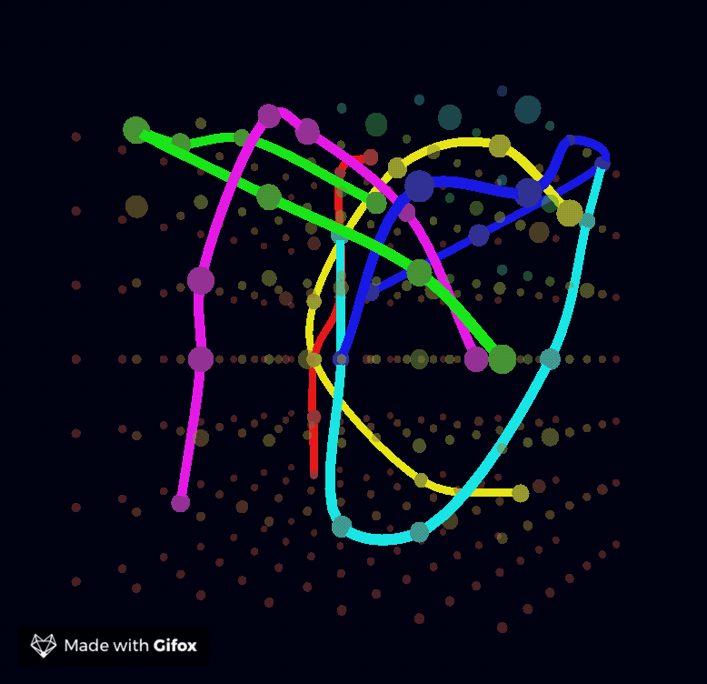

# Cube Visualization
[](https://github.com/google/gts)


A simple component designed to create cool 3d sine wave in cube visualization:




# How to run

To run it either install it as an npm package and import the package as so:

```javascript
import {Container} from 'cube-visualisation-component';
```

or in a browser:
```html
<script src="{Folder where this component is}/dist/index.js"></script>
<!-- Exposed globally under CubeVisualizer -->
<script>
    new CubeVisualizer.Visualizer(document.body, window.innerWidth, window.innerHeight)
</script>
```


# How to build

To build you can simply run: `npm run build` in the directory.

# API 

CubeVisualizer.Container(container, width, height. Optiona)


# License

MIT - See LICENSE